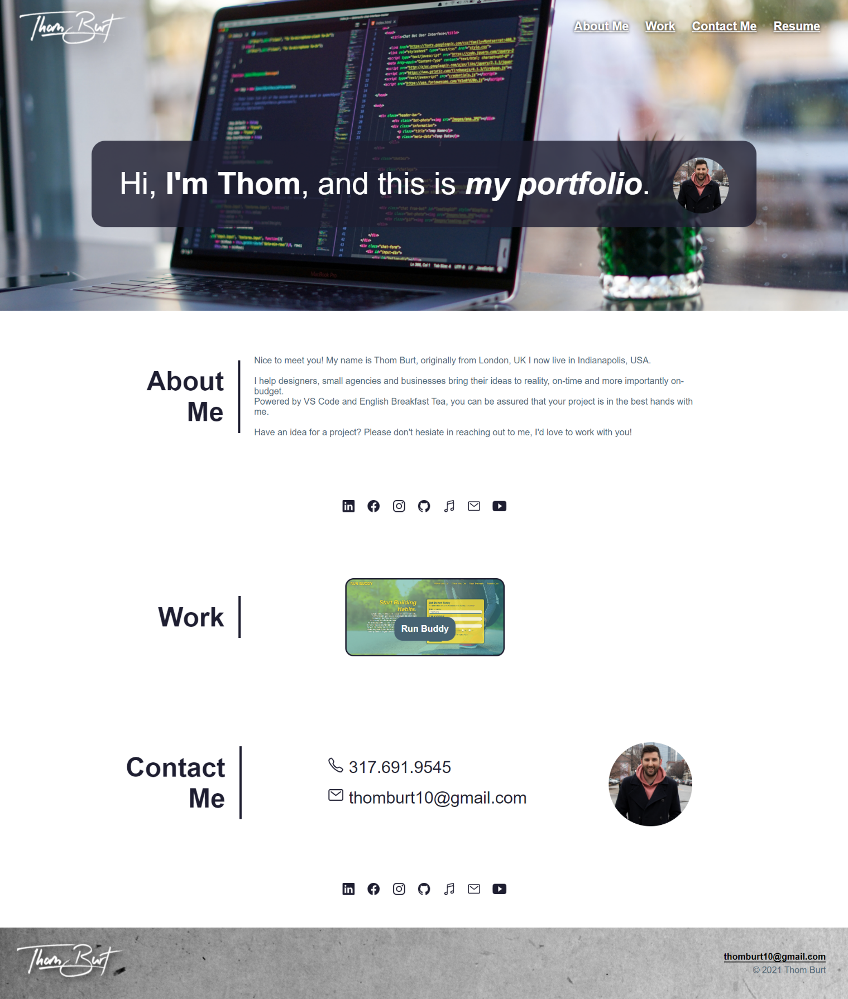

# thom-burt-portfolio

Here is my portfolio, which showcases my work, resume and a little about me.

Here is the URL to the github repository

https://github.com/ThomBurt/thom-burt-portfolio

URL - https://thomburt.github.io/thom-burt-portfolio/

You can see that the header logo in the top left corner is a clickable image of my logo I use for my music work, alongside which is the nav bar which will take you to different parts of the portfolio, and the resume button will take you to my resume which is hosted seperately.

I have also included 2 rows of social media icons which are clickable and using pseudo-classes I have made them feel interactive and fun.

I begun to dive deep into pseudo classes, and have used them multiple times throughout the portfolio.
